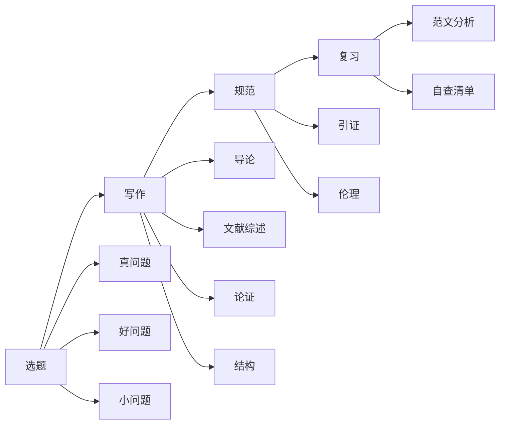
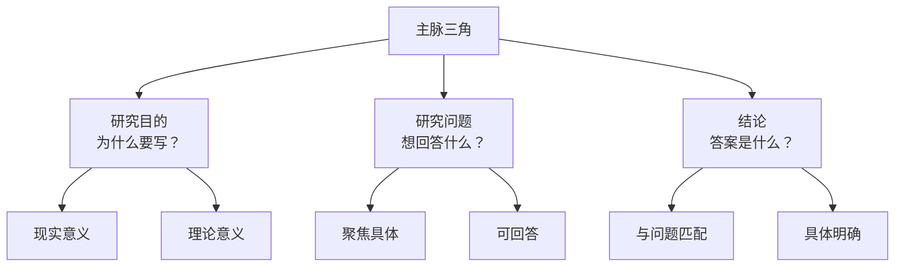
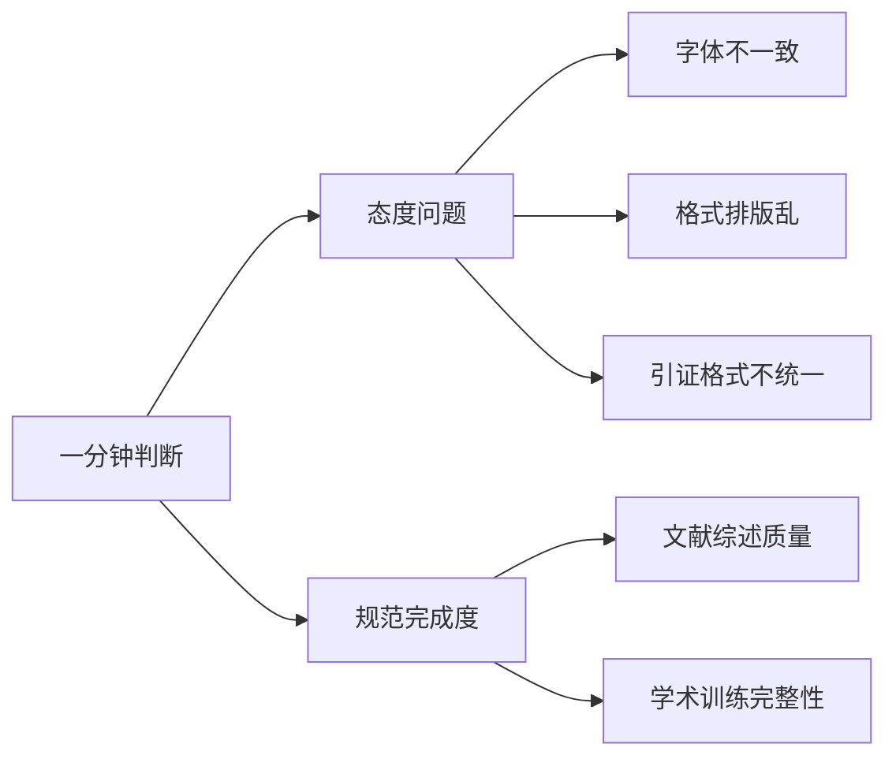

# 论文求生指南知识图谱

> [!info] 课程概述
> 本课程由复旦大学熊浩老师在B站讲授，共12课，覆盖选题、写作、规范、复习四大板块。

---

## 一、课程结构总览



---

## 二、选题三问关系图

> [!tip] 选题三问
> 这是判断选题质量的核心框架

| 问题 | 核心 | 自问 |
|------|------|------|
| **真问题** | 有现实痛感 | 这个问题在你生命中留下过痕迹吗？ |
| **好问题** | 有理论意义 | 能否抽象到更高层面？ |
| **小问题** | 可操作 | 能否聚焦到一个具体案例？ |

> [!example] 理论意义的层次
> - 千里江山图 → 皇帝偏好与艺术品投入的关系
> - 更抽象 → 皇权与艺术的互动
> - 再扩大 → 皇帝偏好对市场/审美的影响

---

## 三、主脉三角结构

> [!important] 核心
> 导论和结论都要锚定这个三角



---

## 四、正文结构三种方式

| 方式 | 适用场景 | 示例 |
|------|----------|------|
| **分类** | 按类型分组 | 宫廷画 vs 文人画 |
| **逻辑** | 因果/解决问题 | 分析问题→解决方案 |
| **要素化** | 核心要素构成 | 冲突四要素：利益/选项/标准/替代方案 |

---

## 五、引证规范

> [!warning] 引证四大原因
> 1. **显摆** — 展示专业知识储备
> 2. **尊重** — 不窃取他人劳动成果
> 3. **证据** — 支撑自己的论点
> 4. **效率** — 区分新旧知识，提升协作效率

### 什么时候需要引证？

> [!question] When in doubt, cite
> 普林斯顿引证指南的核心原则

1. 不是你第一手做出来的 → 需要引证
2. 任何怀疑是否需要引证 → 需要引证
3. 不是众所周知的事实 → 需要引证

### 同类一致性

> [!failure] 常见错误
> - 期刊格式不统一（空格、句号混乱）
> - 全角/半角混用
> - 脚注样式不一致

---

## 六、学术伦理

> [!danger] 无伤害原则
> 研究不能给周围的人造成不便或造成损害

### 伦理委员会审查什么？

| 不审查 | 审查 |
|--------|------|
| 你在研究什么 | 研究会不会对别人产生伤害 |
| 你的结论对不对 | 如何让伤害最小化 |
| | 能否保持保密性 |

### 介入观察的辩证

> [!quote] 长期介入 vs 短期介入
> "我可以演一天，我如果演一年，研究者没崩溃，我崩溃了"
> — 熊浩

---

## 七、老师一分钟判断



> [!success] 自查要点
> - [ ] 字体统一
> - [ ] 段落缩进一致
> - [ ] 引证格式同类统一
> - [ ] 文献综述有学术文献（非新闻资讯）

---

## 八、常见问题清单

| 板块 | 常见问题 |
|------|----------|
| **选题** | 缺理论意义、题目太大、缺乏内在热情 |
| **导论** | 背景当摘要、缺研究问题、文献综述=资料综述 |
| **正文** | 结构混乱、详略不当、像教科书 |
| **引证** | 格式不统一、缺引证、新闻当文献 |
| **伦理** | 无伦理审查、暴露受访者、介入失真 |

---

## 九、课程文件索引

> [!abstract] 文件列表
> ```tasks
> not done
> ```

| 课次 | 文件名 | 核心内容 |
|------|--------|----------|
| 导言 | [[熊浩_论文专题_导言与开篇]] | 课程介绍 |
| 第一课 | [[熊浩_论文专题第一课_研究三问]] | 什么是研究 |
| 第二课 | [[熊浩_论文专题第二课_选题原则_真问题]] | 真问题 |
| 第三课 | [[熊浩_论文专题第三课_选题原则_好问题]] | 好问题 |
| 第四课 | [[熊浩_论文专题第四课_选题原则_小问题]] | 小问题 |
| 第五课 | [[熊浩_论文专题第五课_选题原则_方法论切割]] | 方法论切割 |
| 第六课 | [[熊浩_论文专题第六课_导论写作_背景与研究目的]] | 导论写作 |
| 第七课 | [[熊浩_论文专题第七课_文献综述与研究问题]] | 文献综述 |
| 第八课 | [[熊浩_论文专题第八课_论证与主体部分写作]] | 论证与正文 |
| 第九课 | [[熊浩_论文专题第九课_研究主脉结构与范文分析]] | 主脉结构 |
| 第十课 | [[熊浩_论文专题第十课_引证规范]] | 引证规范 |
| 第十一课 | [[熊浩_论文专题第十一课_学术伦理与研究规范]] | 学术伦理 |
| 第十二课 | [[熊浩_论文专题第十二课_课程总结与最终复习]] | 总结复习 |

---

## 十、可视化资源

> [!note] Obsidian Canvas
> [[熊浩_论文专题_课程总览.canvas]]

---

> [!success] 课程核心观点
> **"写作属于学生，论文写作属于学生，而研究属于所有人"**
> — 用增量回答困惑，让自己更勇敢
