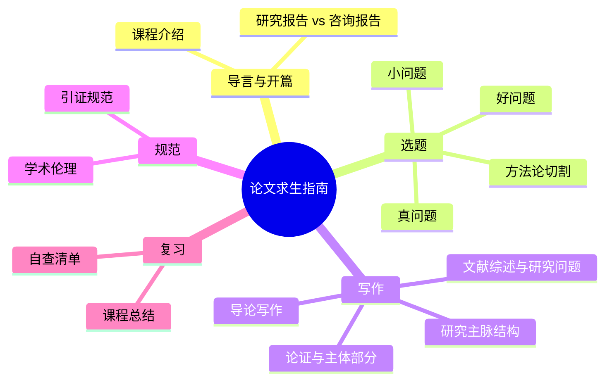
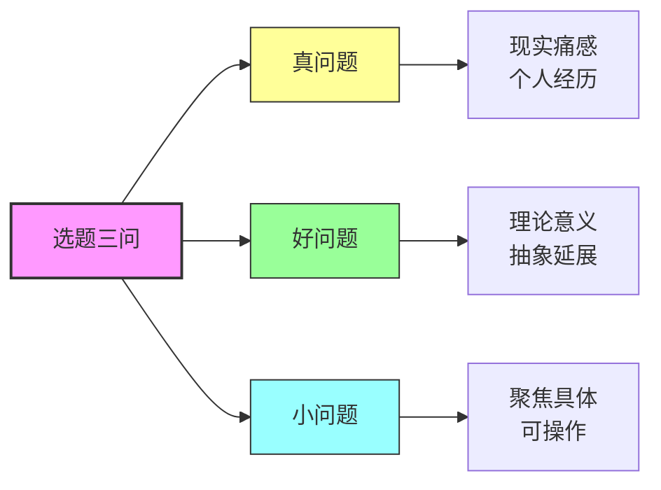
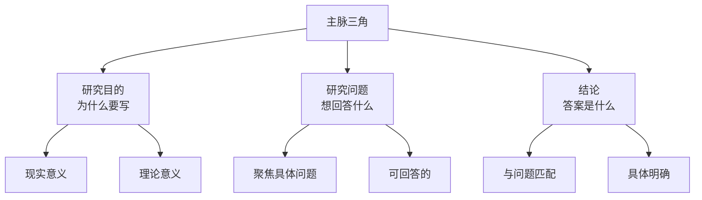
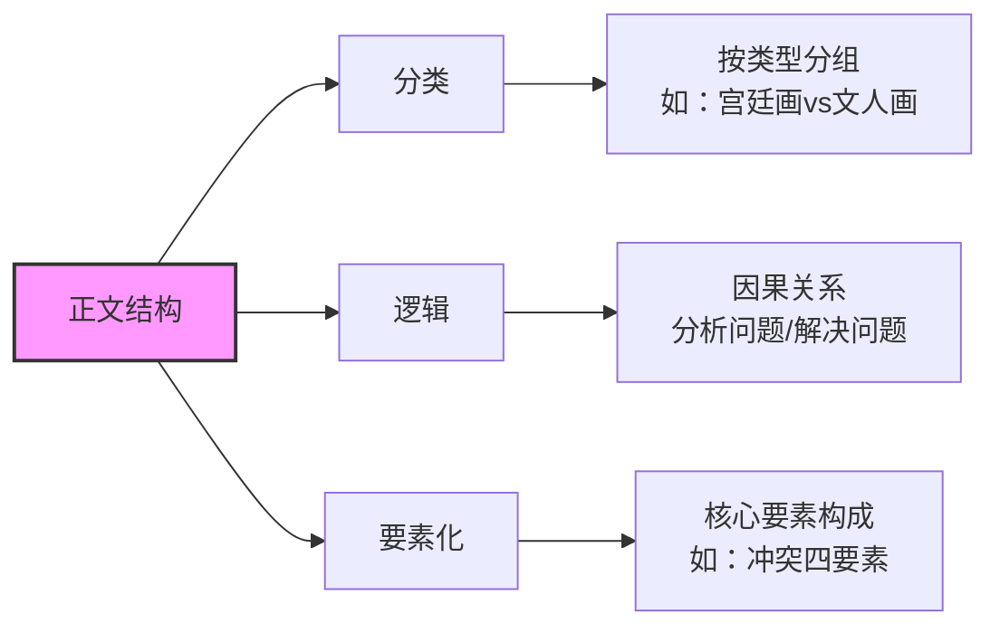
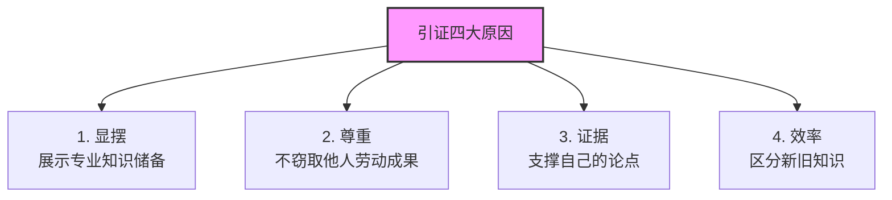
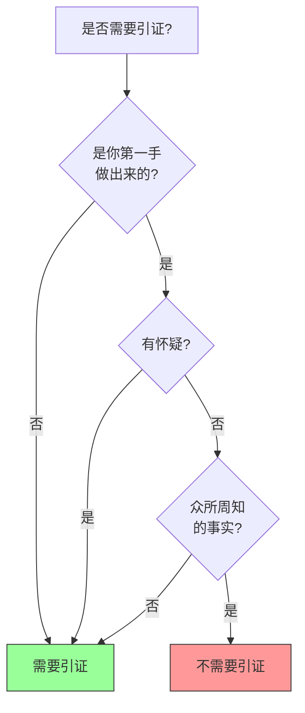
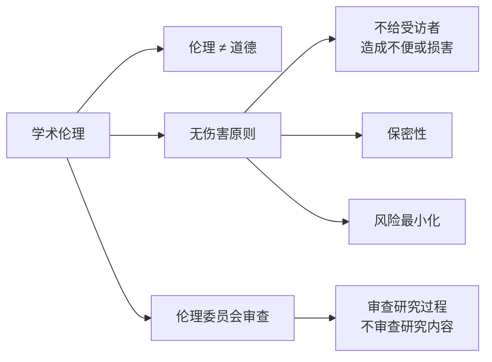
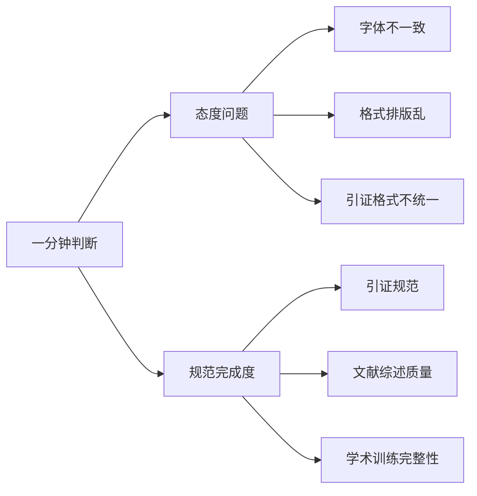
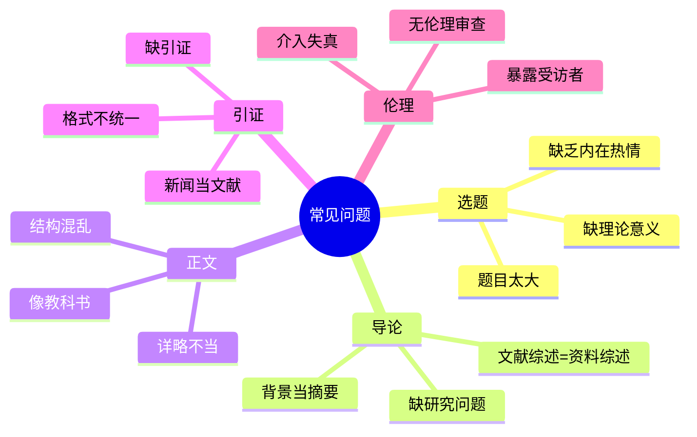
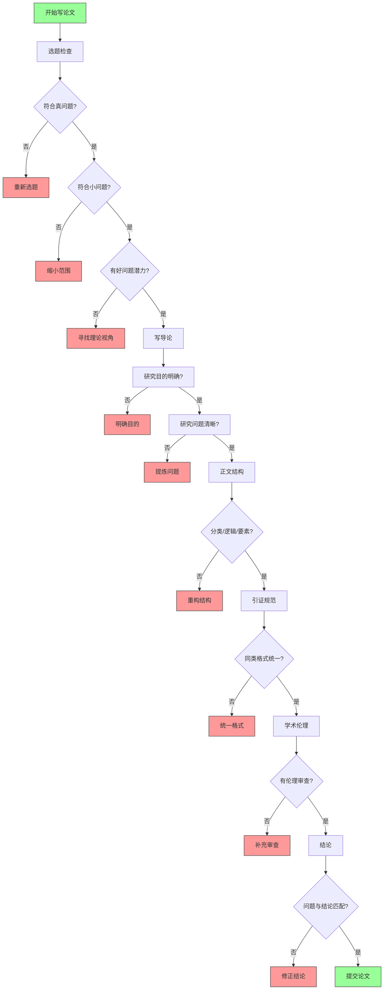

# 论文求生指南：课程可视化总览

> 本文件使用 Mermaid 图表可视化呈现，适合在 Obsidian 等支持 Mermaid 的编辑器中查看。

---

## 一、课程整体结构



---

## 二、选题三问关系图



---

## 三、论文主脉三角结构



---

## 四、正文结构三种方式



---

## 五、引证四大原因



---

## 六、引证判断三标准



---

## 七、学术伦理：无伤害原则



---

## 八、老师快速判断标准



---

## 九、常见论文问题清单



---

## 十、课程文件对应关系

```mermaid
flowchart LR
    subgraph 第一部分：选题
        direction TB
        L1[第一课：研究三问]
        L2[第二课：真问题]
        L3[第三课：好问题]
        L4[第四课：小问题]
        L5[第五课：方法论切割]
    end

    subgraph 第二部分：写作
        direction TB
        L6[第六课：导论写作]
        L7[第七课：文献综述]
        L8[第八课：论证与正文]
        L9[第九课：主脉结构]
    end

    subgraph 第三部分：规范
        direction TB
        L10[第十课：引证规范]
        L11[第十一课：学术伦理]
    end

    subgraph 第四部分：复习
        direction TB
        L12[第十二课：总结复习]
    end

    L1 & L2 & L3 & L4 & L5 --> L6 --> L7 --> L8 --> L9 --> L10 --> L11 --> L12
```

---

## 十一、优秀论文自检流程



---

## 附：Mermaid 在 Obsidian 中的使用

1. **启用方法**：在 Obsidian 设置中开启 "Live Preview" 或使用 "Editing" → "Render Markdown" 支持 Mermaid
2. **快捷键**：输入 ```mermaid 然后按 Tab 或 Enter
3. **实时预览**：Obsidian 1.5+ 内置 Mermaid 支持

如需导出为图片，可使用 **Mermaid CLI** 或 **Typora** 进行渲染。
